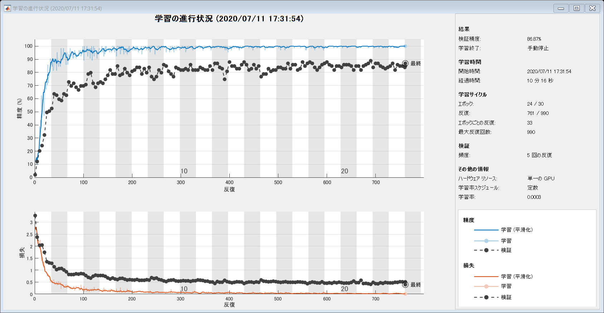
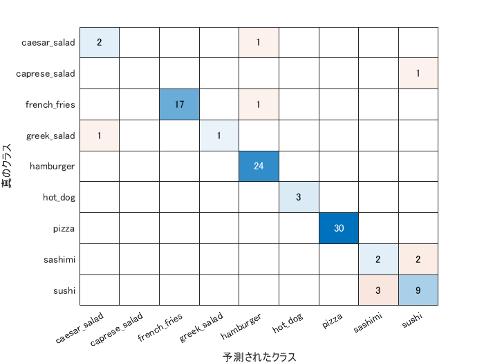

[](https://jp.mathworks.com/matlabcentral/fileexchange/78020-oversampling-for-deep-learning-classification-example)
# Image classification using oversampling imagedatastore 

**[English]**

This example shows how to classify images with imbalanced training dataset where the number of images per class is different over classes. Two of the most popular solutions are down-sampling and over-sampling. In down-sampling, the number of images per class is reduced to the minimal number of images among all classes. On the other hand, the number of images per class is increased when performing over-sampling. Both strategies are effective for imbalanced datasets. Implementation of down-sampling is easy: just use splitEachLabel function and specify the minimal number over the classes, however, over-sampling requires more complicated processes. 

     This code does not use transform datastore that cannot be associated with augmented datastore. It means, it becomes difficult to perform data augmentation with transform datastore as of 2020a. 

**[Japanese]**

このスクリプトでは、オーバーサンプリングと呼ばれる手法を用いて、訓練データ内での各クラスの画像の枚数を均一にします。深層学習による画像分類では、分類するクラスの訓練データの枚数がクラス間でばらつきがあると学習が難しくなります。クラス間で枚数が不均衡になってしまう場合の対策として有名なもので、オーバーサンプリングやダウンサンプリングと呼ばれるものがあります。ダウンサンプリングでは、各クラスで最も少ない枚数にあわせ、多い画像は利用しないもので、MATLABでのコーディングは比較的簡単です。一方、オーバーサンプリングの場合は、少し実装が複雑になります。この例ではオーバーサンプリングによる画像分類の例を示します。

  


#  Load data

Please download Food image dataset provided from MathWorks. The Example Food Images data set contains 978 photographs of food in nine classes (*ceaser_salad*, *caprese_salad*, *french_fries*, *greek_salad*, *hamburger*, *hot_dog*, *pizza*, *sashimi*, and *sushi*).

Other dataset is available at [https://jp.mathworks.com/help/deeplearning/ug/data-sets-for-deep-learning.html.](https://jp.mathworks.com/help/deeplearning/ug/data-sets-for-deep-learning.html.) 

```matlab:Code
clear;clc;close all
url = "https://www.mathworks.com/supportfiles/nnet/data/ExampleFoodImageDataset.zip";
downloadFolder = pwd;
filename = fullfile(downloadFolder,'ExampleFoodImageDataset.zip');

dataFolder = fullfile(downloadFolder, "ExampleFoodImageDataset");
if ~exist('ExampleFoodImageDataset.zip')
    fprintf("Downloading Example Food Image data set (77 MB)... ")
    websave(filename,url);
    unzip(filename,downloadFolder);
    fprintf("Done.\n")
end

imds=imageDatastore('myimages', ...
    'IncludeSubfolders',true,'LabelSource','foldernames');
[imdsTrain, imdsValid,imdsTest]=splitEachLabel(imds,0.8,0.1);
```

# Confirm the imbalance

Note that the number of images among the classes is imbalanced. 

```matlab:Code
labelCount = countEachLabel(imdsTrain)
```

| |Label|Count|
|:--:|:--:|:--:|
|1|caesar_salad|21|
|2|caprese_salad|12|
|3|french_fries|145|
|4|greek_salad|19|
|5|hamburger|190|
|6|hot_dog|25|
|7|pizza|239|
|8|sashimi|32|
|9|sushi|99|

I refferred to [https://jp.mathworks.com/help/vision/examples/point-cloud-classification-using-pointnet-deep-learning.html](https://jp.mathworks.com/help/vision/examples/point-cloud-classification-using-pointnet-deep-learning.html) for this section. 

```matlab:Code
histogram(imdsTrain.Labels)
labels=imdsTrain.Labels;
[G,classes] = findgroups(labels);
numObservations = splitapply(@numel,labels,G);
```

`desiredNumObservationsPerClass` is the maximum number of sample among all classes. 

```matlab:Code
desiredNumObservationsPerClass = max(numObservations);
```

`randReplicateFiles` is a supporting function just shuffling the files. The number of images to select is difined by  `desiredNumObservationsPerClass`. Then, the files are randomly extracted from `imdsTrain.Files`. 

```matlab:Code
files = splitapply(@(x){randReplicateFiles(x,desiredNumObservationsPerClass)},imdsTrain.Files,G);
files = vertcat(files{:});
labels=[];info=strfind(files,'\');
for i=1:numel(files)
    idx=info{i};
    dirName=files{i};
    targetStr=dirName(idx(end-1)+1:idx(end)-1);
    targetStr2=cellstr(targetStr);
    labels=[labels;categorical(targetStr2)];
end
imdsTrain.Files = files;
imdsTrain.Labels=labels;
labelCount_oversampled = countEachLabel(imdsTrain)
```

| |Label|Count|
|:--:|:--:|:--:|
|1|caesar_salad|239|
|2|caprese_salad|239|
|3|french_fries|239|
|4|greek_salad|239|
|5|hamburger|239|
|6|hot_dog|239|
|7|pizza|239|
|8|sashimi|239|
|9|sushi|239|

```matlab:Code
histogram(imdsTrain.Labels)
```

# Load the pre-trained model, ResNet-18

```matlab:Code
net = resnet18;
inputSize = net.Layers(1).InputSize;
lgraph = layerGraph(net);
learnableLayer='fc1000';
classLayer='ClassificationLayer_predictions';
```

# Modify the network for the current task

```matlab:Code
numClasses = numel(categories(imds.Labels));
newLearnableLayer = fullyConnectedLayer(numClasses, ...
        'Name','new_fc', ...
        'WeightLearnRateFactor',10, ...
        'BiasLearnRateFactor',10);
lgraph = replaceLayer(lgraph,learnableLayer,newLearnableLayer);
newClassLayer = classificationLayer('Name','new_classoutput');
lgraph = replaceLayer(lgraph,classLayer,newClassLayer);
```

# Define image augmenter 

```matlab:Code
pixelRange = [-30 30];
RotationRange = [-30 30];
scaleRange = [0.8 1.2];
imageAugmenter = imageDataAugmenter( ...
    'RandXReflection',true, ...
    'RandXTranslation',pixelRange, ...
    'RandYTranslation',pixelRange, ...
    'RandXScale',scaleRange, ...
    'RandYScale',scaleRange, ...
    'RandRotation',RotationRange ...
    ); 
augimdsTrain = augmentedImageDatastore(inputSize(1:2),imdsTrain, ...
     'DataAugmentation',imageAugmenter);
augimdsValid = augmentedImageDatastore(inputSize(1:2),imdsValid);
augimdsTest = augmentedImageDatastore(inputSize(1:2),imdsTest);
```

# Specify the training options

```matlab:Code
miniBatchSize = 64;
valFrequency = max(floor(numel(augimdsTest.Files)/miniBatchSize)*10,1);
options = trainingOptions('sgdm', ...
    'MiniBatchSize',miniBatchSize, ...
    'MaxEpochs',30, ...
    'InitialLearnRate',3e-4, ...
    'Shuffle','every-epoch', ...
    'ValidationData',augimdsValid, ...
    'ValidationFrequency',valFrequency, ...
    'Verbose',false, ...
    'Plots','training-progress');
```

# Train the network

```matlab:Code
net = trainNetwork(augimdsTrain,lgraph,options);
```



# Classification assessment 

```matlab:Code
[YPred,probs] = classify(net,augimdsTest);
accuracy = mean(YPred == imdsTest.Labels)
```

```text:Output
accuracy = 0.9072
```

```matlab:Code
YValidation = imdsTest.Labels;
YTrue=imdsTest.Labels;
figure;cm=confusionchart(YTrue,YPred);
```



When I run this code, the main mis-classification was made between sashimi and sushi, which look similar. Please try this code for over-sampling and hope it helps your work. 

# Supporting function

This sub-function randomly replicate the image directry for each class. When the target class is A, the image directry of image A was found from imds.Files and the image directry was copied in order to balance the number of images over the classes. 

```matlab:Code
function files = randReplicateFiles(files,numDesired)
n = numel(files);
ind = randi(n,numDesired,1);
files = files(ind);
end
```
